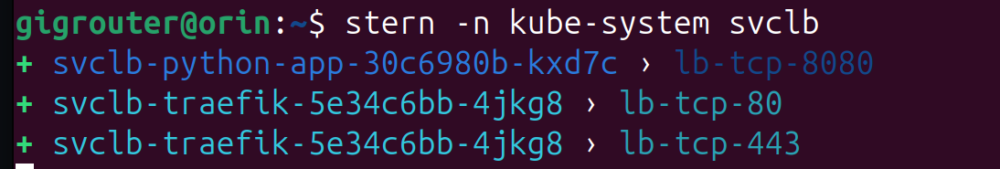

# K3s Overview

## Use of k3s on GigRouter

The GigRouter metrics collection, web console and other system services provided with the GigRouter are predominantly running in a k3s environment.

## What is k3s?

K3s is a lightweight Kubernetes environment. It is an orchestration framework that supports deploying services in separate pods or containers, distributing these amongsts multiple computers running as nodes in a cluster, specifying the resource needs (CPU/disk), configuring networking, and abstracting resources such as filesystems to this locally hosted cloud environment.

K3s allows separation of services in pods where the entire filesystem, dependent libraries and specific versions of libraries can be configured specifically for the individual service, independent of other services. This modularization also makes it easy to scale or substitute similar services.

## Why run within k3s and not directly on the machine?

One of the goals of k3s is containerization. With Python as an example, you can separate the Python version, requirements, dependencies and code of your application in its own pod environment. Additionally, this should result in a fairly portable set of yaml files to easily run your app in some other k3s environment.

If you can build and run a service in k3s then it is relatively straightforward to migrate this service to some other cloud environment such as Google Kubernetes Engine and vice versa. Even if you don't need some of the supported portability or scalability, the support for modularizing resources, specifying resource needs, building replicable images to provide a consistent environment for running services and other bundled services such as ingress support for http/https helps standardize much of your applications or services.

## Related Documentation

The main documentation discusses the motivation behind the use of Kubernetes:
[Why Kubernetes](https://docs.gigrouter.space/book/v2.2.0/users_guide/software/container_orchestration.html#why-kubernetes)

The official base Kubernetes documentation can be found here: [Kubernetes Home](https://kubernetes.io/docs/home/)

The official k3s docs can be found here: [K3s Official Docs](https://rancher.com/docs/k3s/latest/en/)

See also [K3S-TIPS.md](./K3S-TIPS.md)

## K3S Definitions

The following are some of the terms you will come across as use of k3s is discussed. For any of the terms that you are not familiar with, you can check most definitions on the main [kubernetes.io](https://kubernetes.io) site at its glossary page: [Kubernetes Glossary](https://kubernetes.io/docs/reference/glossary/)

* [Node](https://kubernetes.io/docs/reference/glossary/?fundamental=true#term-node)
* [Cluster](https://kubernetes.io/docs/reference/glossary/?fundamental=true#term-cluster)
* [Deployment](https://kubernetes.io/docs/reference/glossary/?fundamental=true#term-deployment)
* [DaemonSet](https://kubernetes.io/docs/reference/glossary/?fundamental=true#term-daemonset)
* [Namespace](https://kubernetes.io/docs/reference/glossary/?fundamental=true#term-namespace)

Terms found elsewhere:
* [ConfigMap](https://kubernetes.io/docs/concepts/configuration/configmap/)
* [Storage](https://docs.k3s.io/storage)
  * Persistent Volume
  * Persistent Volume Claim
* [Networking](https://docs.k3s.io/networking)
  * Ingress

## K3S Assumptions

Here, we assume you are accessing the GigRouter's bundled k3s environment as a starting point.

### The k3s environment includes some built-in services

* **kube-dns** (or CoreDNS as the default k3s implementation) for name lookups in k3s networking
* **local-path-provisioner** for managing disk storage volumes
* **metrics-server** for collecting CPU and memory usage metrics and exposing them through the Metrics API
* **svclb-traefik** for simple load balancing (with a copy of `svclb-SERVICENAME` appearing for each `SERVICENAME` using a load balancer)
* **traefik** for ingress network traffic handling

### The default k3s setup uses only basic namespaces

Namespaces can help group or organize resources. The primary namespaces in use are `kube-system` and `default`.

`kube-system` is used by the k3s core services. It can also be used for any custom services that more fit the definition of core services (like `generic-device-plugin`) but `kube-system` is generally reserved for k3s itself.

Namespace `default` is used for most k3s resources as it is the literal default namespace if no explicit namespace is specified. Simply using `default` is perfectly fine unless you have reason to organize your resources with namespaces. Primarily, it's important to understand that you will only see the default namespace unless you specify namespace arguments to `kubectl`. When you are querying k3s, you'd typically either supply argument `-n NAMESPACE`, use `-A` for "all" namespaces or list only resources in the default namespace if no specification is given. For example, `kubectl get pods` will list the pods in the **default namespace only** which will omit `kube-system` as well as any other namespaces.

Example commands:

`kubectl get pods` to view all pods in default namespace only

`kubectl get pods -A` to view all pods in all namespaces

`kubectl -n kube-system get pods` to view all pods in `kube-system` namespace only

### Terminal shell environment

We also assume you have an environment that's configured to pull any required Debian packages or k3s images that are provided for the GigRouter that aren't in public repositories. That is, some of the examples may pull artifacts from Cambrian's Cloudsmith repository which requires tokens for access.

## K3S Helper Tools

### Command Completion

The Cambrian Works bundling of k3s includes `bash` shell command line completion for `kubectl` commands. Examples:

`kubectl ge<TAB>` should autocomplete to `kubectl get`

`kubectl de<TAB>` will show options are `debug`, `delete`, and `describe`

`kubectl get pod p<TAB>` might autocomplete to `kubectl get pod python-app-6f874589dd-k2ld6`

### Stern

The Cambrian Works installation of k3s bundles `stern` which is a log viewer tool that supports matching and color coding output of different pods. Think of this as potentially `tail`ing the output of logs from several pods at once and color coding based on the source pod for any given output.

Below shows `stern` matching on 2 different `svclb` pods and color coding output from each:



### Editors

If you wish to edit a live resource in k3s, your `EDITOR` environment variable will be consulted for your preferred editor (`vim`, `pico`, `nano`, etc.) similar to how `git` and other tools will use `EDITOR` or `VISUAL` environment variables to pull your preferred editor.

If you're not familiar with the use of the more arcane commands for using `vim` (the default editor) then using something like `nano` is suggested:

```
sudo apt install nano
export EDITOR=nano
```

To make sure this persists, the following will add this setting to your `~/.bashrc` (or adjust as needed for different shells):

```
echo "export EDITOR=nano" >> ~/.bashrc
```

### JQ

Although not required, the tool `jq` can come in handy if `json` outputs are ever to be parsed on the command line or simply to pretty-print json output:

```
$ echo '{"val1": 7, "cmd": "kubectl", "args": ["-n", "default", "get", "pods"]}' | jq .
{
  "val1": 7,
  "cmd": "kubectl",
  "args": [
    "-n",
    "default",
    "get",
    "pods"
  ]
}
```

### Linux Command line tools

The examples make use of common Linux tools such as `grep`, `sed`, and `awk` for looking for matching text, rewriting text or extracting fields from output.

## K3S Core Commands

The `kubectl` command line tool provides most everything you need for configuring and querying k3s.

Configuring `k3s` is generally done by creating declarative yaml files and using `kubectl apply -f FILENAME.yaml` to either create a new k3s resource or update an existing resource.

Once `applied`, you can edit the LIVE k3s resource with commands of form:

```
kubectl edit K3S_TYPE k3S_SPECIFIC_RESOURCE [-n NAMESPACE]
```

(`-n NAMESPACE` is optional if you are using namespace `default` for the resource)

Once you save the resource, changes will be applied immediately. However, some changes may not take effect until the resource is next referenced or used.

The `get` command can generally be used to list a certain type of k3s resource.

For example, to list all currently running pods:

```
kubectl get pods -A
```

Above, the `-A` means to list pods across ALL namespaces.

You can get different columns in your output depending on your options.

**NOTE:** This can be very important if you are piping the output of your command into a tool that's extracting the contents of the nth column. Here are some examples:

```
$ kubectl get pods
NAME                             READY   STATUS    RESTARTS   AGE
python-app-6f874589dd-k2ld6      1/1     Running   0          9d
```

The namespace is omitted since above is looking only at the implied namespace `default`.

```
$ kubectl get pods -A
NAMESPACE     NAME                                      READY   STATUS    RESTARTS       AGE
default       python-app-6f874589dd-k2ld6               1/1     Running   0              9d
kube-system   coredns-7b98449c4-blbm9                   1/1     Running   0              29d
kube-system   local-path-provisioner-595dcfc56f-cqj8d   1/1     Running   0              29d
kube-system   metrics-server-cdcc87586-zsh2m            1/1     Running   0              14d
kube-system   traefik-d7c9c5778-qsbxf                   1/1     Running   0              29d
```

Above, the `NAMESPACE` is now in the first column and the pod `NAME` has moved to the 2nd column.

If you prefer working with `json` and want to see an alternative output format, try:

```
kubectl get pods -o json
```

For additional columns with the first command, add `-o wide`:

```
$ kubectl get pods -o wide
NAME                             READY   STATUS    RESTARTS   AGE     IP           NODE                NOMINATED NODE   READINESS GATES
python-app-6f874589dd-k2ld6      1/1     Running   0          9d      10.42.0.36   k3s-1423522021480   <none>           <none>
```

Now, you can see some additional fields that might sometimes prove useful.

If you are wanting to watch for changes as they happen and have the command run until you hit `CTRL-c`, add `-w` or `--watch` after your `get` subcommand:

```
kubectl get -w pods
```

To get details about a particular pod, you can see variations with these 3 methods.

Let's just list a specific pod based on the name:

```
$ kubectl get pod python-app-6f874589dd-k2ld6
NAME                          READY   STATUS    RESTARTS   AGE
python-app-6f874589dd-k2ld6   1/1     Running   0          9d
```

"Describe" the pod also based on the name:

```
$ kubectl describe pod python-app-6f874589dd-k2ld6
Name:             python-app-6f874589dd-k2ld6
Namespace:        default
Priority:         0
Service Account:  default
Node:             k3s-1423522021480/192.168.86.34
Start Time:       Mon, 13 Jan 2025 21:02:18 +0000
Labels:           app=python-app
                  pod-template-hash=6f874589dd
Annotations:      <none>
Status:           Running
IP:               10.42.0.36
IPs:
  IP:           10.42.0.36
Controlled By:  ReplicaSet/python-app-6f874589dd
Containers:
  python-app:
    Container ID:  containerd://270706136d9209372a2752c9432ed93a0ab8d521de502dfcf604da7f62b9a4b3
    Image:         python:3.11-slim
    Image ID:      docker.io/library/python@sha256:370c586a6ffc8c619e6d652f81c094b34b14b8f2fb9251f092de23f16e299b78
    Port:          8080/TCP
    Host Port:     0/TCP
    Command:
      /bin/sh
      -c
    Args:
      pip install --no-cache-dir -r /app/requirements.txt &&
      python /app/app.py
      
    State:          Running
      Started:      Mon, 13 Jan 2025 21:02:19 +0000
    Ready:          True
    Restart Count:  0
    Environment:    <none>
    Mounts:
      /app from app-volume (rw)
      /var/run/secrets/kubernetes.io/serviceaccount from kube-api-access-8kjvm (ro)
Conditions:
  Type                        Status
  PodReadyToStartContainers   True 
  Initialized                 True 
  Ready                       True 
  ContainersReady             True 
  PodScheduled                True 
Volumes:
  app-volume:
    Type:      ConfigMap (a volume populated by a ConfigMap)
    Name:      python-app-config
    Optional:  false
  kube-api-access-8kjvm:
    Type:                    Projected (a volume that contains injected data from multiple sources)
    TokenExpirationSeconds:  3607
    ConfigMapName:           kube-root-ca.crt
    ConfigMapOptional:       <nil>
    DownwardAPI:             true
QoS Class:                   BestEffort
Node-Selectors:              <none>
Tolerations:                 node.kubernetes.io/not-ready:NoExecute op=Exists for 300s
                             node.kubernetes.io/unreachable:NoExecute op=Exists for 300s
Events:                      <none>
```

Now, try the original `get` but with `-o yaml`. This:
1. Provides output in the same form as your input yaml (though with additional fields for timestamp, etc.)
2. Would be the yaml text as you'd see in your edit if you ran `kubectl edit RESOURCE_NAME`

```
$ kubectl get pod python-app-6f874589dd-k2ld6 -o yaml
apiVersion: v1
kind: Pod
metadata:
  creationTimestamp: "2025-01-13T21:02:18Z"
  generateName: python-app-6f874589dd-
  labels:
    app: python-app
    pod-template-hash: 6f874589dd
  name: python-app-6f874589dd-k2ld6
  namespace: default
  ownerReferences:
  - apiVersion: apps/v1
    blockOwnerDeletion: true
    controller: true
    kind: ReplicaSet
    name: python-app-6f874589dd
    uid: 2b8634f6-7583-44ff-bd3d-cc61b0103529
  resourceVersion: "258643"
  uid: 0649ab99-8db7-4620-a0e0-891b3f66912a
spec:
  containers:
  - args:
    - |
      pip install --no-cache-dir -r /app/requirements.txt &&
      python /app/app.py
    command:
    - /bin/sh
    - -c
    image: python:3.11-slim
    imagePullPolicy: IfNotPresent
    name: python-app
    ports:
    - containerPort: 8080
      protocol: TCP
    resources: {}
    terminationMessagePath: /dev/termination-log
    terminationMessagePolicy: File
    volumeMounts:
    - mountPath: /app
      name: app-volume
    - mountPath: /var/run/secrets/kubernetes.io/serviceaccount
      name: kube-api-access-8kjvm
      readOnly: true
  dnsPolicy: ClusterFirst
  enableServiceLinks: true
  nodeName: k3s-1423522021480
  preemptionPolicy: PreemptLowerPriority
  priority: 0
  restartPolicy: Always
  schedulerName: default-scheduler
  securityContext: {}
  serviceAccount: default
  serviceAccountName: default
  terminationGracePeriodSeconds: 30
  tolerations:
  - effect: NoExecute
    key: node.kubernetes.io/not-ready
    operator: Exists
    tolerationSeconds: 300
  - effect: NoExecute
    key: node.kubernetes.io/unreachable
    operator: Exists
    tolerationSeconds: 300
  volumes:
  - configMap:
      defaultMode: 420
      name: python-app-config
    name: app-volume
  - name: kube-api-access-8kjvm
    projected:
      defaultMode: 420
      sources:
      - serviceAccountToken:
          expirationSeconds: 3607
          path: token
      - configMap:
          items:
          - key: ca.crt
            path: ca.crt
          name: kube-root-ca.crt
      - downwardAPI:
          items:
          - fieldRef:
              apiVersion: v1
              fieldPath: metadata.namespace
            path: namespace
status:
  conditions:
  - lastProbeTime: null
    lastTransitionTime: "2025-01-13T21:02:19Z"
    status: "True"
    type: PodReadyToStartContainers
  - lastProbeTime: null
    lastTransitionTime: "2025-01-13T21:02:18Z"
    status: "True"
    type: Initialized
  - lastProbeTime: null
    lastTransitionTime: "2025-01-13T21:02:19Z"
    status: "True"
    type: Ready
  - lastProbeTime: null
    lastTransitionTime: "2025-01-13T21:02:19Z"
    status: "True"
    type: ContainersReady
  - lastProbeTime: null
    lastTransitionTime: "2025-01-13T21:02:18Z"
    status: "True"
    type: PodScheduled
  containerStatuses:
  - containerID: containerd://270706136d9209372a2752c9432ed93a0ab8d521de502dfcf604da7f62b9a4b3
    image: docker.io/library/python:3.11-slim
    imageID: docker.io/library/python@sha256:370c586a6ffc8c619e6d652f81c094b34b14b8f2fb9251f092de23f16e299b78
    lastState: {}
    name: python-app
    ready: true
    restartCount: 0
    started: true
    state:
      running:
        startedAt: "2025-01-13T21:02:19Z"
  hostIP: 192.168.86.34
  hostIPs:
  - ip: 192.168.86.34
  phase: Running
  podIP: 10.42.0.36
  podIPs:
  - ip: 10.42.0.36
  qosClass: BestEffort
  startTime: "2025-01-13T21:02:18Z"
```

**TIP:** After creating a resource with `kubectl apply -f FILENAME.yaml` it's quite useful to review the yaml actively in use with `kubectl get -n NAMESPACE RESOURCE_TYPE RESOURCE_NAME -o yaml` to see what additional fields were populated as defaults. Examples:

* Omission of a namespace generally results in an explicit `namespace: default` in the active yaml
* An auto-created PV will show it was created with `Delete` as its reclaim policy which you might choose to `edit` or `patch` to a different reclaim policy of `Retain`
* Creation of some resources have a default timeout value when stopping the resource and you might wish to shorten this if teardown speed is important (see `terminationGracePeriodSeconds` above as an example)
* You can also simply see some of the added fields to get an idea of what else you might want to customize or look up what the property means

Once you've created a resource, you can remove it with `delete` in one of many forms:
* `delete RESOURCETYPE RESOURCENAME` (example: `kubectl delete pods PODNAME`)
* `delete RESOURCETYPE/RESOURCENAME` (good for deleting many different resource types at once; example: `kubectl delete pods/PODNAME deploy/DEPLOYNAME`)
* `delete -f FILENAME.yaml` (good for deleting all resources from a `kubectl apply -f FILENAME.yaml` command; example: `kubectl delete -f FILENAME.yaml`)

There are some caveats:
1. **BE ORDERLY:** Your delete might hang if the resource is in use until whatever is using it has also finished.
  * **TIP:** Delete resources in a logical order to avoid this or delete multiple resources at once. Multiple items in the command line are deleted from left to right order and from a yaml file are deleted from top to bottom order.
2. **BE CAREFUL:** If you delete a service that's in use then users won't be able to access it once gone or if you delete a persistent volume that's marked as `Delete` then you'll lose the files in that volume.
3. **BE PATIENT:** When resources are coming up you might see `Pending` status and similarly you'll see `Terminating` status when it takes time to delete resources.
4. **SANITY CHECK:** Some resources are automatically recreated. A good case of this is when a `pod` is created by a `deployment`. Often, you can delete a `pod` but the `deployment` will simply spin up a new pod with a different unique name.

### Modularity

There are a small set of `kubectl` commands (`apply`, `get`, `edit`, `delete`, `describe`, etc.) that can be applied to a number of resources of different types and with different instantiated names.

### Fully specified names

You can combine the resource type and name together with `/`, for example, to delete many different resource types at once:

```
kubectl delete pv/file-upload-pv pvc/file-upload-pvc svc/file-service deployments.apps/file-service
```

**NOTE:** Above, `deploy` or `deployments` would also work as a shorthand for `deployment.apps`. You can see these name variations with:

```
kubectl api-resources
```

You'll see the canonical names are pluralized but `kubectl` will also accept the singular version of names such as `pod` for `pods`.

Shortcut names are also given such as `svc` for `services`.

## Troubleshooting

### General documentation

You can always consult the latest documentation and [FAQ](https://docs.gigrouter.space/book/v2.2.0/faq.html) for any issues not covered here.

### Checking that k3s is installed and up

If the `kubectl` command does not exist or `kubectl get node` simply returns errors or warnings then k3s itself is having trouble.

### Check overall node health and status

Running the following is useful to see that the main node is available and find its name:

```
kubectl get node
```

Then, to get the overal status of k3s and details of the node, run:

```
kubectl describe node
```

The following excerpt shows some of the values expected on a healthy node:

```
Taints:             <none>
Unschedulable:      false
Conditions:
  Type             Status  LastHeartbeatTime                 LastTransitionTime                Reason                       Message
  ----             ------  -----------------                 ------------------                ------                       -------
  MemoryPressure   False   Tue, 13 May 2025 19:29:53 +0000   Wed, 16 Apr 2025 20:36:50 +0000   KubeletHasSufficientMemory   kubelet has sufficient memory available
  DiskPressure     False   Tue, 13 May 2025 19:29:53 +0000   Wed, 16 Apr 2025 20:36:50 +0000   KubeletHasNoDiskPressure     kubelet has no disk pressure
  PIDPressure      False   Tue, 13 May 2025 19:29:53 +0000   Wed, 16 Apr 2025 20:36:50 +0000   KubeletHasSufficientPID      kubelet has sufficient PID available
  Ready            True    Tue, 13 May 2025 19:29:53 +0000   Wed, 16 Apr 2025 20:36:50 +0000   KubeletReady                 kubelet is posting ready status
```

The "Taints" would indicate problem(s) that have tainted the system. `Unschedulable: true` would indicate you at least couldn't start any new pods on the node. Under `Conditions`, `Ready: True` is the key to seeing a healthy pod. Resource problems are flagged with `pressure` and all 3 pressure problems above have status `False`.

Freeing memory or disk as needed would be a way to clear memory or disk problems.

For k3s, the term "cordon" is a way to make a node unschedulable to not support running new pods. This could be done for maintenance reasons or could be due to an issue at startup during node configuration.

The following shows what a cordoned node would look like:

```
$ kubectl get node
NAME                STATUS                     ROLES                  AGE   VERSION
k3s-1611224610117   Ready,SchedulingDisabled   control-plane,master   60d   v1.30.6+k3s1
```

Notably, we see `SchedulingDisabled` under `STATUS`.

And, from describing the node, we would see:

```
$ kubectl describe node
...
Taints:             node.kubernetes.io/unschedulable:NoSchedule
Unschedulable:      true
...
```

Given the node name above, we could resolve this by uncordoning the node with the following command:

```
$ kubectl uncordon k3s-1611224610117
node/k3s-1611224610117 uncordoned
```

After this, the node should resume its ability to schedule pods.

### Checking pod health

In general, simply running

```
kubectl get pods -A
```

will let you see if the expected number of pods are running and if they are healthy.

If a pod is not starting, you can often get useful info from running:

```
kubectl -n default describe pods PODNAME
```

Or, to view its log output, either:

```
kubectl -n default logs -f PODNAME
```

or

```
stern -n default MATCHSTRING
```

Shortcuts:
* With tab-completion enabled, `kubectl -n default logs -f mypod<TAB>` can help auto-complete the long pod name
* With `stern`, the MATCHSTRING could be made to match one or more pods: `stern -n default mypod` would show logs for all pods matching string `mypod`

### Check persistent volume filesystems

You can list persistent volumes that a pod can mount on local fileystem with:

```
kubectl get pv
```

To check the mount point and status of a particular pv, you can `describe` it:

```
$ kubectl get pv
NAME                                       CAPACITY   ACCESS MODES   RECLAIM POLICY   STATUS   CLAIM                           STORAGECLASS           VOLUMEATTRIBUTESCLASS   REASON   AGE
pvc-33eb5a29-914f-45d5-9a81-c23a215e20f9   100Gi      RWO            Retain           Bound    default/otel-file-metrics-pvc   local-path-telemetry   <unset>                          50d


$ kubectl describe pv pvc-33eb5a29-914f-45d5-9a81-c23a215e20f9 
Name:              pvc-33eb5a29-914f-45d5-9a81-c23a215e20f9
Labels:            <none>
Annotations:       local.path.provisioner/selected-node: k3s-1611224610117
                   pv.kubernetes.io/provisioned-by: rancher.io/local-path
Finalizers:        [kubernetes.io/pv-protection]
StorageClass:      local-path-telemetry
Status:            Bound
Claim:             default/otel-file-metrics-pvc
Reclaim Policy:    Retain
Access Modes:      RWO
VolumeMode:        Filesystem
Capacity:          100Gi
Node Affinity:     
  Required Terms:  
    Term 0:        kubernetes.io/hostname in [k3s-1611224610117]
Message:           
Source:
    Type:          HostPath (bare host directory volume)
    Path:          /mnt/telemetry/metrics/pvc-33eb5a29-914f-45d5-9a81-c23a215e20f9_default_otel-file-metrics-pvc
    HostPathType:  DirectoryOrCreate
Events:            <none>
```

Above, `Capacity` is a hint for space the pv is allowed to grow to and `Path` shows the location of the pv on disk. Given the `Path`, you can check current usage and free space with:

```
$ sudo du -hs /mnt/telemetry/metrics/pvc-33eb5a29-914f-45d5-9a81-c23a215e20f9_default_otel-file-metrics-pvc
9.8G	/mnt/telemetry/metrics/pvc-33eb5a29-914f-45d5-9a81-c23a215e20f9_default_otel-file-metrics-pvc

$ sudo df -h /mnt/telemetry/metrics/pvc-33eb5a29-914f-45d5-9a81-c23a215e20f9_default_otel-file-metrics-pvc
Filesystem      Size  Used Avail Use% Mounted on
/dev/nvme0n1p2  183G  9.8G  164G   6% /mnt/telemetry
```

In this case, all 9.8G used are attributed to the pv. The host filesystem has 164G available and that is well over the extra 90.2Gi we want to reserve for the specified 100Gi `Capacity`. Note that many of these values are "loose" in the sense that stopping growth at 100Gi is not necessarily enforced and warning that available `Capacity` is lower than the desired limit is also not likely. (This could change in future versions of `local-path-provisioner`.)
